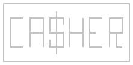

<p align="center">  </p>

#  [![build-badge]][build-link] [![codecov-badge]][codecov-link] [![license-badge]][license-link]
A simple general use cache written entirely in swift. Anything can be added to the cache as long as it subscribes to the `Cacheable` protocol, and anything as a key as long as it subscribes to `CacheableKey` protocol.

## Features
- Lightweight Caching generic
- Does One Thing & Does It Well

## Usage

Create a cache
```swift
let cache = Cache<String: Data>()
```

Add an item to a cache
```swift
let item = Data()
cache["MyItem"] = item
```

Get an item from cache
```swift
let cachedItem = cache["MyItem"]
```

Get an item from a url
```swift
cache.load(from: someUrl, key: "MyItem") { cachedItem, wasDownload, error in

}
```

#### Built in Image Cache

Add an item to a cache
```swift
let image = UIImage()
ImageCache.shared["MyItem"] = image
```

Get an item from cache
```swift
let cachedImage = ImageCache.shared["MyItem"]
```

Setting an image on an image view
```swift
imageView.set(url: someUrl)
```

#### Precaching

Downloading images right to cache for later use
```swift
let imagePrecher = ImagePrecher()
imagePrecher.get(urls: myUrls) { items, failedUrls in
  //Do something
}
```


## Installation

### CocoaPods

```ruby
pod 'Cacher'
```

### Carthage

```ogdl
github "MountainBuffalo/Cacher"
```

## Contributing
If you wish to contribute to Cacher, please submit a pull request!

## License
Cacher is licensed under the [MIT License](license-link). As such, Casher is free for general usage, and would make an excellent addition to your next swift application!

[build-link]:https://travis-ci.org/MountainBuffalo/Cacher
[build-badge]:https://travis-ci.org/MountainBuffalo/Cacher.svg?branch=master "Travis-CI Build"

[codecov-link]:http://codecov.io/github/MountainBuffalo/Cacher
[codecov-badge]:http://codecov.io/github/MountainBuffalo/Cacher/coverage.svg "Code Coverage"

[license-link]:https://choosealicense.com/licenses/mit/
[license-badge]:https://img.shields.io/badge/license-MIT-yellow.svg "MIT License"
